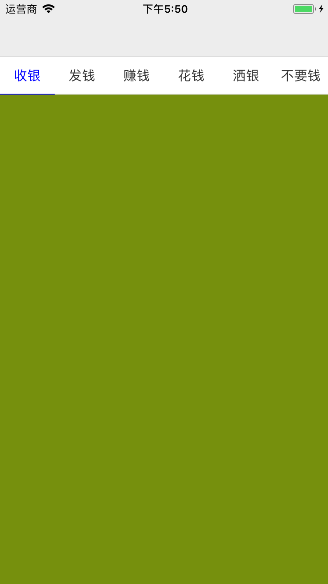

## 模仿android viewPager 控件





### 创建

````
 		self.pageControl = MMPageControlView.init(frame: .zero, style: .noscroll)
 		/** 默认展示位置，默认展示索引为1的元素 */
        self.pageControl?.defaultIndex = 1
        self.pageControl?.delegate = self
        self.view.addSubview(self.pageControl!)
````

**pageControl 和tableView一样有两种样式**


````
/// page control 的标题视图会不会滚动
///
/// - scroll: 会滚动
/// - noscroll: 不会滚动
enum MMPageControlViewTitleStyle {
    case scroll
    case noscroll
}
````

#### UI自定义
##### titleButtonLayoutCallBack标题按钮创建的回调,可以自己定义按钮样式
##### titleViewLayoutCallBack 标题view创建的回调，可自定义样式
````

 /// 标题view 布局回调
    open var titleViewLayoutCallBack : ((MMPageControlStackTitleView) -> Void)?

    /// 标题button 布局回调
    ///
    /// - Parameter
    ///        -index: 标题的索引
    ///        -button: 标题的索引
    open var titleButtonLayoutCallBack : ((_ button : MMPageControlStackTitleButton,_ index : Int) -> Void)?
    

````


#### 协议模仿UITableView 的实现方法，使用简单 模仿UITableView协议 的实现方法，使用简单

````
/// pageview 协议
@objc protocol MMPageControlViewDelegate : NSObjectProtocol {


    /// 必须实现协议 标题的个数
    ///
    /// - Returns: 数量
    func numberForPageControlView() -> Int


    /// 必须实现协议 标题的文本返回
    ///
    /// - Parameter index: 标题的索引
    /// - Returns: 返回标题的文本
    func titleForTitleViewIndex(index:Int) -> String


    /// 必须实现
    ///
    /// - Parameter index: 索引
    /// - Returns: 返回view 展示在列表
    func viewForCollectionViewIndex(index:Int) -> UIView


    /// 标题的按钮被选中
    ///
    /// - Parameters:
    ///   - selected: 被选中的按钮
    ///   - last: 上次被选中的按钮
    ///   - index: 被选中的索引
    /// - Returns:
    @objc optional func titleSelected(at selected:MMPageControlStackTitleButton,last:MMPageControlStackTitleButton,index:Int) -> Void


/**以下为可选实现协议*/

    /// 按钮被选中的颜色
    ///
    /// - Returns: 颜色
    @objc optional func titleSelectColor() -> UIColor

    /// 按钮未被选中的颜色
    ///
    /// - Returns: 颜色
    @objc optional func titleNormalColor() -> UIColor

    /// 标题和内容f分割线的颜色
    ///
    /// - Returns: color
    @objc optional func titleLineNormalColor() -> UIColor


    /// 是否允许标题按钮被点击
    /// *只有点击按钮才会被执行*
    /// - Parameters:
    ///   - selected: 被选中的按钮
    ///   - last: 上次被选中的按钮
    ///   - index: 被选中的索引
    /// - Returns: 是否允许被选中
    @objc optional func titleShouldWillSelected(at selected:MMPageControlStackTitleButton,last:MMPageControlStackTitleButton,index:Int) -> Bool;


}
````